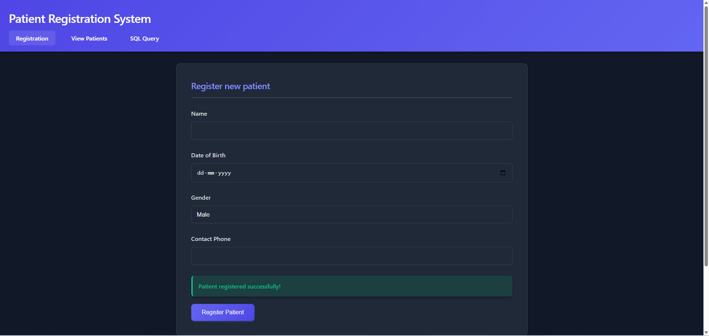
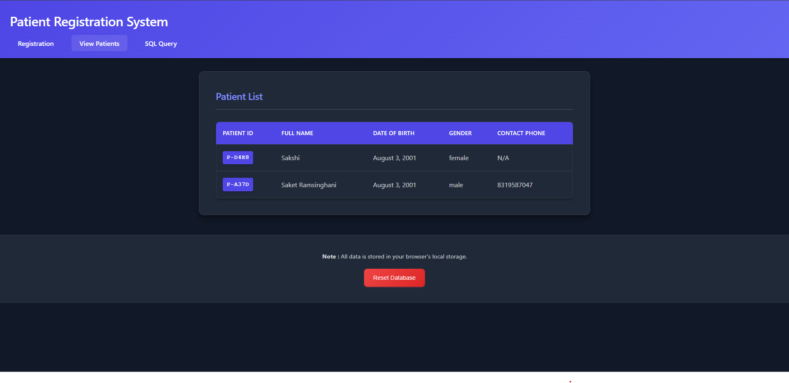
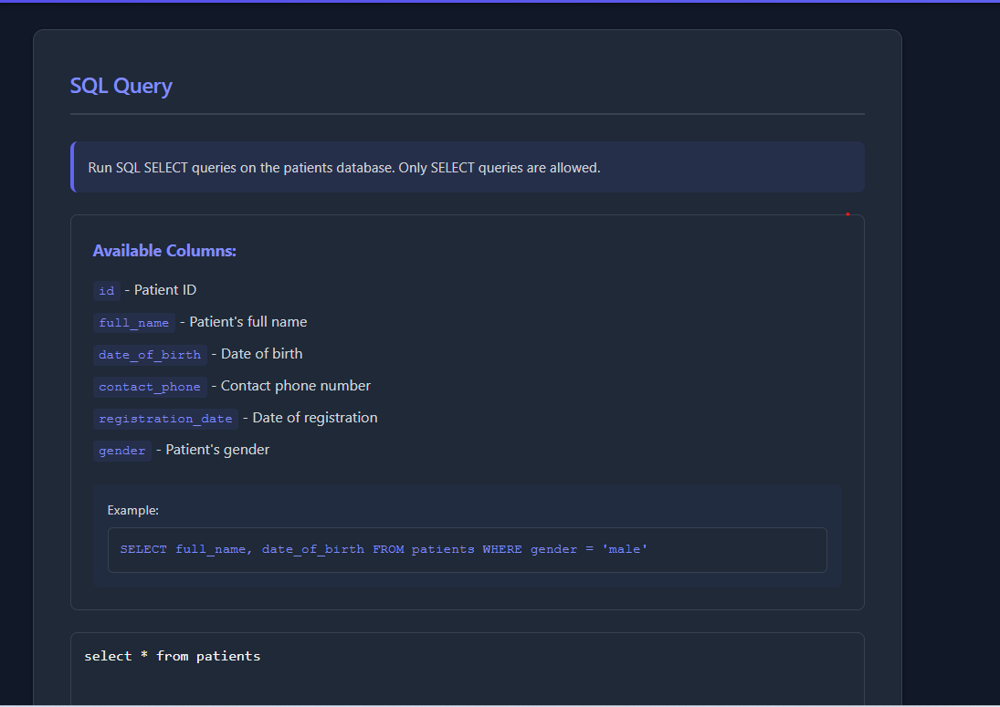

# Patient Registration System

A modern web application for managing patient registrations with a sleek dark mode interface. Built with vanilla JavaScript and PGlite for client-side database management.

## Features

- 📝 Patient registration with validation
- 📋 View all registered patients
- 🔍 SQL query interface for custom data retrieval
- 💾 Local storage using IndexedDB
- 🌙 Modern dark mode interface
- 📱 Responsive design

## Screenshots

### Patient Registration Form

*Modern registration form with validation and dark mode interface*

### Patient List View

*View all registered patients with formatted patient IDs*

### SQL Query Interface

*Run custom SQL queries with available columns information*


## Live Demo

[View Live Demo](https://patient-registration-frontend.vercel.app/)

## Local Development

### Prerequisites

- A modern web browser (Chrome, Firefox, Safari, or Edge)
- Node.js installed (for using npx serve)

### Setup

1. Clone the repository:
```bash
git clone https://github.com/yourusername/patient-registration-system.git
cd patient-registration-system
```

2. Start the local server (no installation required):
```bash
npx serve .
```
This will start the server at http://localhost:3000

3. Open your browser and navigate to http://localhost:3000

Note: No `npm install` is required as all dependencies are loaded via CDN.

## Database Schema

The application uses PGlite (a client-side PostgreSQL implementation) with the following schema:

```sql
CREATE TABLE patients (
    id TEXT PRIMARY KEY,
    full_name TEXT NOT NULL,
    date_of_birth DATE NOT NULL,
    contact_phone TEXT,
    registration_date TIMESTAMP DEFAULT CURRENT_TIMESTAMP,
    gender TEXT NOT NULL
);
```

## Available SQL Queries

You can run SELECT queries on the following columns:
- `id` - Patient ID
- `full_name` - Patient's full name
- `date_of_birth` - Date of birth
- `contact_phone` - Contact phone number
- `registration_date` - Date of registration
- `gender` - Patient's gender

Example query:
```sql
SELECT full_name, date_of_birth FROM patients WHERE gender = 'male'
```

## Technologies Used

- HTML5
- CSS3
- JavaScript (ES6+)
- [PGlite](https://github.com/electric-sql/pglite) - Client-side PostgreSQL implementation
- [IndexedDB](https://developer.mozilla.org/en-US/docs/Web/API/IndexedDB_API) - Browser database

## Contributing

1. Fork the repository
2. Create your feature branch (`git checkout -b feature/AmazingFeature`)
3. Commit your changes (`git commit -m 'Add some AmazingFeature'`)
4. Push to the branch (`git push origin feature/AmazingFeature`)
5. Open a Pull Request


## Acknowledgments

- [PGlite](https://github.com/electric-sql/pglite) for the client-side database implementation
- [Netlify](https://www.netlify.com) for hosting the demo
